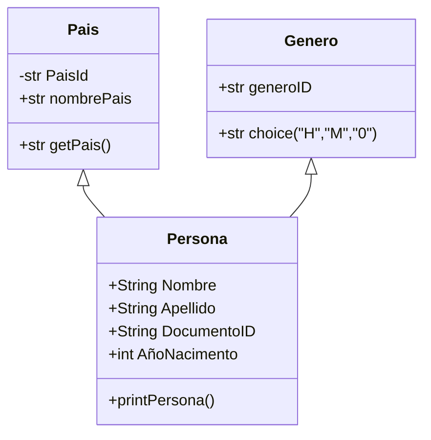

# java_clase_persona

```mermaid

---
title Diagrama Clase Persona
---
classDiagram
    Pais <|-- Persona
    Genero <|-- Persona
    
    class Persona{
      +String Nombre
      +String Apellido
      +String DocumentoID
      +int AñoNacimento
      +printPersona()
    }
    class Pais{
      -str PaisId
      +str nombrePais
      +str getPais()
    }
    class Genero{
      +str generoID
      +str choice("H","M","0")
    }

```